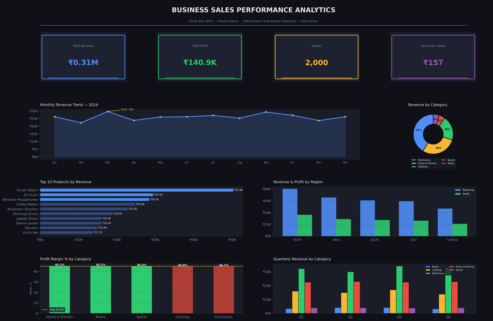

# FUTURE_DS_01 — Business Sales Performance Analytics

**Intern:** Shiv Kumar | **CIN:** FIT/MAY26/DS17882  
**Program:** Data Science & Analytics — Future Interns  
**Duration:** 13 May 2026 → 13 June 2026

---

## 📌 Task Overview

Analyze business sales data to identify revenue trends, top-selling products, high-value categories, and regional performance — then deliver a client-ready dashboard with actionable recommendations.

---

## 📊 Dashboard Preview



---

## 🔑 Key Findings

| Metric | Value |
|---|---|
| Total Revenue | ₹3,13,573 |
| Total Profit | ₹1,40,850 |
| Profit Margin | 44.9% |
| Total Orders | 2,000 |
| Avg Order Value | ₹157 |

### Top Category — Electronics (41% of revenue)
Electronics leads with ₹1,29,559 in revenue. Smart Watch and Wireless Headphones are the #1 and #2 products overall.

### Best Margin Category — Home & Kitchen (46.2%)
Despite being #2 in revenue, Home & Kitchen delivers the highest profit margins, making it the most efficient category.

### Top Region — North (₹80,442)
The North region outperforms all others in both revenue and profit. Central region is the weakest and needs attention.

### Revenue Trend
Sales peak mid-year (Q2–Q3), suggesting seasonal demand. Q4 shows a slight dip — a potential window for promotional campaigns.

---

## 💡 Recommendations

1. **Double down on Electronics** — highest revenue driver; expand product range or bundle deals.
2. **Invest in Home & Kitchen** — best margins; increase marketing spend to grow volume.
3. **Target Central region** — lowest performer; consider region-specific discounts or campaigns.
4. **Run Q4 promotions** — counter the seasonal dip with end-of-year sales events.
5. **Reduce discounts on Books & Sports** — lowest revenue categories with thin margins; discounting here hurts more than it helps.

---

## 🛠️ Tools Used

- **Python** — pandas, numpy, matplotlib
- **Dataset** — Simulated business sales data (2,000 transactions, 2024)

## 📁 Files

| File | Description |
|---|---|
| `sales_analysis.py` | Full Python analysis + dashboard code |
| `sales_data.csv` | Generated sales dataset |
| `sales_dashboard.png` | Final dashboard image |

---

## ▶️ How to Run

```bash
pip install pandas numpy matplotlib
python sales_analysis.py
```

---

*Submitted as part of the Future Interns Data Science & Analytics Internship — Task 1*
